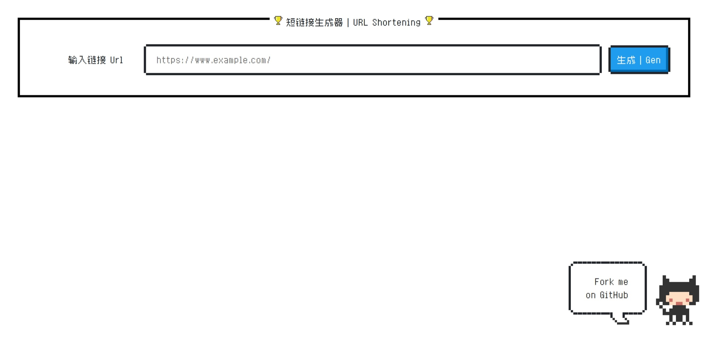
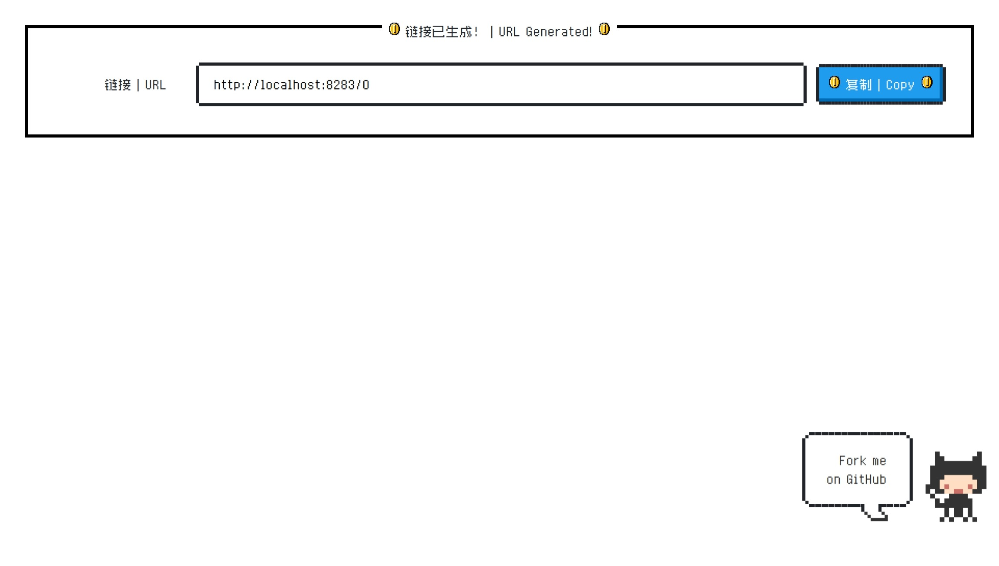

<div align="center">
    <h1>短网址生成器</h1>
    <a href="README-zh-CN.md">简体中文</a> / <a href="README.md">English</a>
</div>

## 介绍

由于网上没有找到好用的短网址生成器，所以自己写了一个。基于Flask框架，使用mongoDB作为数据库，可以使用docker-compose一键部署。

生成短链接的原理是使用mongoDB生成的自增ID，将其转换为62进制，再将其作为短链接的后缀。利用短网址访问时，将短链接后缀转换为10进制，再根据ID查询数据库，获取原始链接，最后302重定向到原始链接。

## 截图




## 使用方法

### 使用docker-compose部署 (推荐)

1. 编辑`config.docker.ini`文件，将`base_url`修改为你的域名，其他配置不用改动。
2. 运行`docker-compose up -d`即可。

### 直接运行

1. 安装mongoDB
2. 编辑`config.ini`文件，具体配置见文件内注释。

   ```yml
    [server]
    port = 8283 ; 短网址服务运行端口
    base_url = http://localhost:8283/ ; 短网址服务运行地址

    [database]
    host = localhost ; 数据库地址
    port = 27017 ; 数据库端口
    login = 0 ; 是否需要登录 [0:不需要 1:需要]
    user = root ; 数据库用户名
    password = password ; 数据库密码
   ```

3. 安装依赖

   ```shell
    pip install -r requirements.txt
    ```

4. 运行

   ```shell
    python main.py
    ```

## 鸣谢

- [NES.css](https://github.com/nostalgic-css/NES.css)
