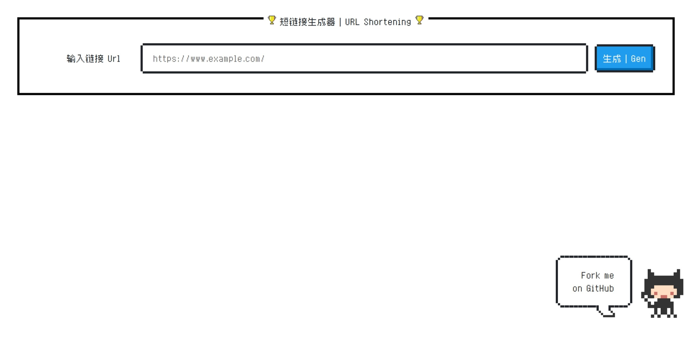
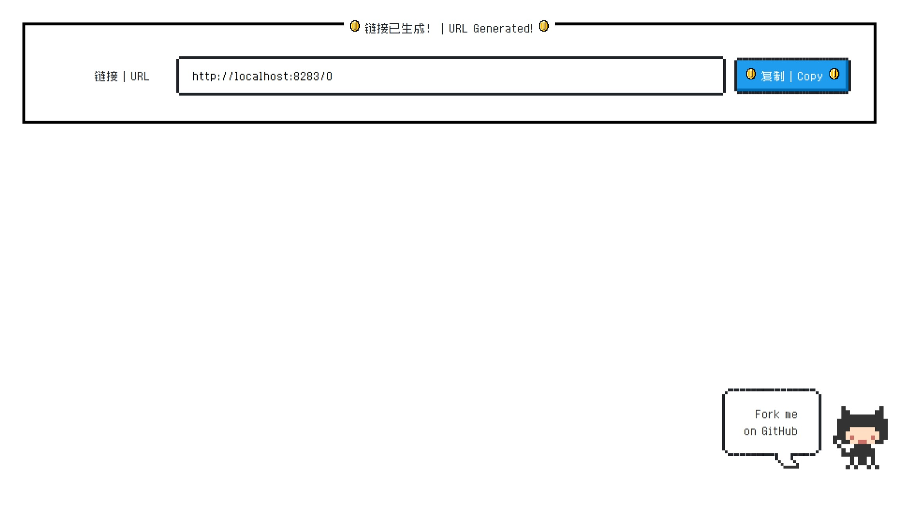

<div align="center">
    <h1>Short Url Generator</h1>
    <a href="README-zh-CN.md">简体中文</a> / <a href="README.md">English</a>
</div>

## Introduction

Because I can't find a good short url generator online, I wrote one myself. Based on the Flask framework, using mongoDB as the database, you can use docker-compose to deploy it.

The principle of generating short links is to use the self-increasing ID generated by mongoDB, convert it to 62 binary, and then use it as the suffix of the short link. When using the short URL to access, convert the short link suffix to 10 binary, then query the database according to the ID to obtain the original link, and finally 302 redirect to the original link.

## Screenshot




## Usage

### Deploy using docker-compose (Recommended)

1. Edit the `config.docker.ini` file and modify `base_url` to your domain name, and other configurations do not need to be modified.
2. Run `docker-compose up -d`.

### Run directly

1. Install mongoDB
2. Edit the `config.ini` file, see the file comments for specific configuration.
3. Install dependencies

   ```bash
    pip install -r requirements.txt
    ```

4. Run

   ```bash
    python main.py
    ```

## Thanks

- [nostalgic-css/NES.css](https://github.com/nostalgic-css/NES.css)
